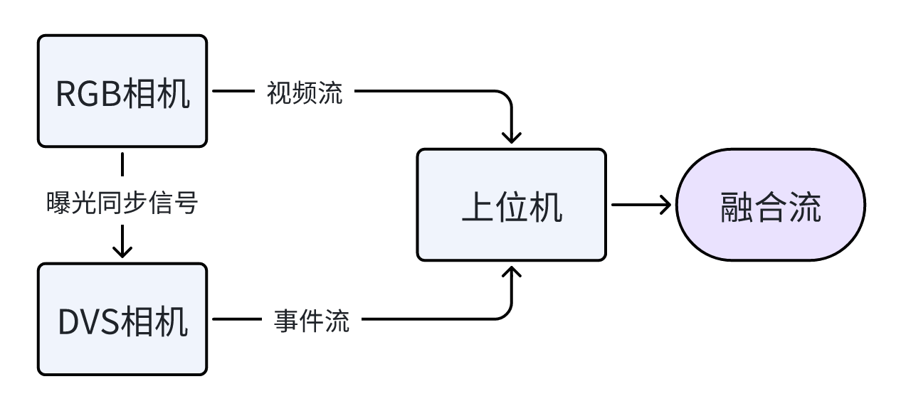
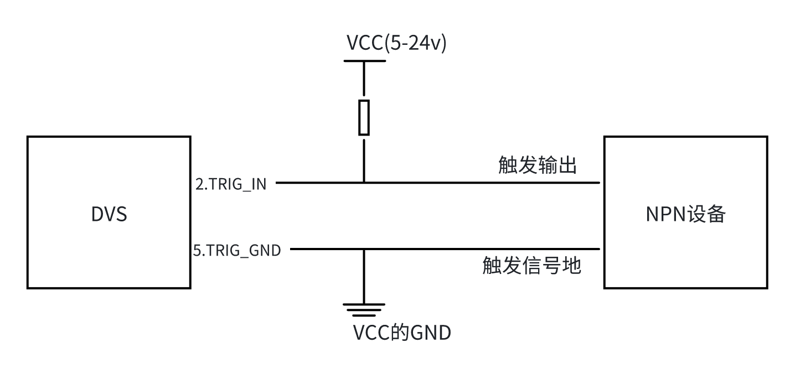
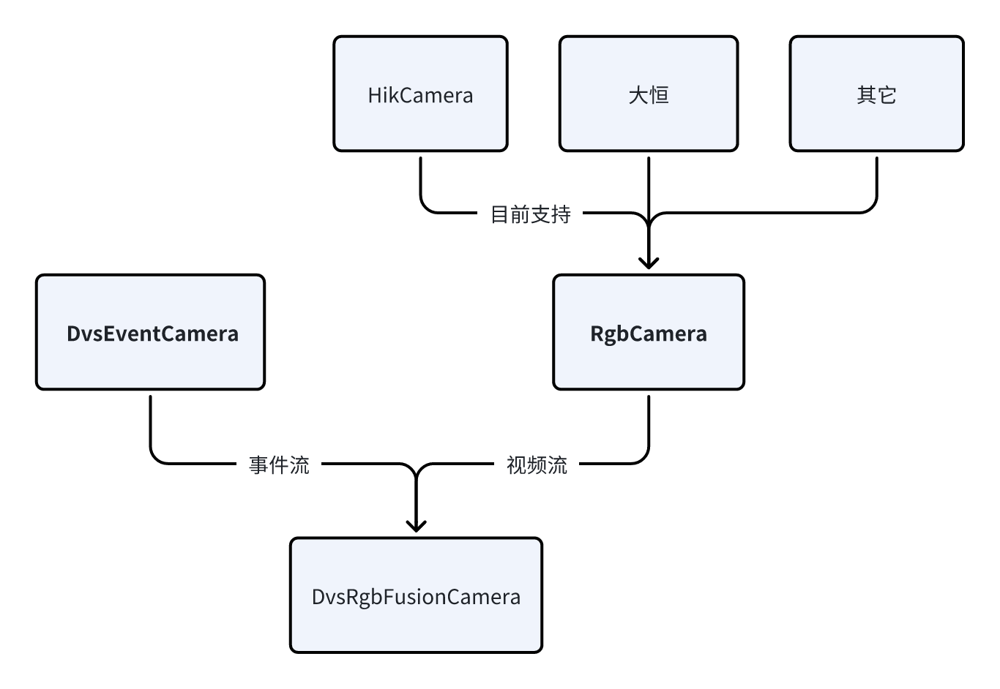

DVS-RGB相机套装SDK使用指南

# 项目简介

该项目为动微视觉-事件相机DVS与RGB相机的套装驱动，通过硬件级同步技术实现微秒级时域对齐，为机器人视觉、自动驾驶、工业检测等高精度场景提供时空一致的多模态视觉数据。

# 硬件准备  

DVS事件相机[DVSLume](https://dvsense.com/dvslume)，RGB相机（目前支持海康相机，未来将支持到更多厂家），触发线， 触发电源，上拉电阻

# 接线方式
针对NPN型相机（常开），接线如图所示：

# 在Windows上编译
## 安装Dvsense driver
访问动微视觉官网<https://dvsense.com/>，获取最新的dvsense driver，下载并安装。

## 安装RGB相机驱动
以Hik相机为例，访问Hik官网<https://www.hikrobotics.com/cn/>，获取最新的相机驱动，下载并安装。
注意，如果您使用的是第三方相机，则需要安装相机供应商提供的驱动，并实现RgbCamera抽象类中所有的接口。 

## 安装支持使用ffmpeg作为后端的opencv
该 SDK 的视频处理功能依赖 OpenCV 和 FFmpeg 生态，支持以 FFmpeg 作为 OpenCV 的后端视频处理引擎。
推荐使用vcpkg执行以下命令进行安装:  

    .\vcpkg install opencv[ffmpeg] --triplet x64-window  

## 克隆 GitHub 存储库
在终端中输入以下克隆命令：  

## 编译
1. 设置CMake中RGB相机驱动的路径MVS_LIB_SEARCH_PATHS和MVS_INCLUDE_DIR；  
    可根据实际情况修改路径  

        set(MVS_LIB_SEARCH_PATHS "C:/Program Files (x86)/MVS/Development/Libraries/win64/")  
        set(MVS_INCLUDE_DIR "C:/Program Files (x86)/MVS/Development/Includes")

2. 确保已安装Visual Studio 2022 (Community Edition 或更高版本)，或别的c++开发工具；  

3. 在源码根目录下创建并配置 CMake 构建目录；  

4. 编译完成后，您可以：  
    - 运行samples 目录下的示例程序测试功能；  
    - 参考 API 文档开发自定义应用；  
    - 修改源码并重新编译以满足特定需求。

# 在Linux上编译
## 安装Dvsense driver  
访问动微视觉官网<https://dvsense.com/>，获取最新的dvsense driver，下载并安装。 

## 安装RGB相机驱动
以Hik相机为例，访问Hik官网<https://www.hikrobotics.com/cn/>，获取最新的相机驱动，下载并安装。  
注意，如果您使用的是第三方相机，则需要安装相机供应商提供的驱动，并实现RgbCamera抽象类中所有的接口。

## 安装支持使用ffmpeg作为后端的opencv
该 SDK 的视频处理功能依赖 OpenCV 和 FFmpeg 生态，支持以 FFmpeg 作为 OpenCV 的后端视频处理引擎。
推荐使用apt进行安装 

    # 更新包列表  
    sudo apt update  
    
    # 安装 FFmpeg
    sudo apt install ffmpeg libavcodec-dev libavformat-dev libswscale-dev

    # 安装 OpenCV 和 Python 绑定
    sudo apt install libopencv-dev python3-opencv
## 克隆 GitHub 存储库
在终端中输入以下克隆命令：  

    git clone ______
## 编译
1. 设置CMake中RGB相机驱动的路径MVS_LIB_SEARCH_PATHS和MVS_INCLUDE_DIR；  
可根据实际情况修改路径  

        set(MVS_LIB_SEARCH_PATHS "/opt/MVS/lib/64")  
        set(MVS_INCLUDE_DIR /opt/MVS/include/)

2. 设置好之后，在源码根目录下创建并配置 目录；

        mkdir build && cd build 
        cmake ..
        make

3. 编译完成后，您可以：  
    - 运行samples 目录下的示例程序测试功能；  
    - 参考 API 文档开发自定义应用；  
    - 修改源码并重新编译以满足特定需求。

# 快速开始
1. 将DVS相机和RGB相机分别接入到电脑上，同时连接好触发线  
2. 导入DvsRgbFusionCamera头文件  

        #include "DvsRgbFusionCamera.hpp"
3. 创建相机实例（设置帧率为60FPS，默认为30FPS）  

        std::unique_ptr<DvsRgbFusionCamera> fusionCamera = std::make_unique<DvsRgbFusionCamera>(60);
4. 打开相机并检查相机连接状态，如果返回为true，表示两台相机连接成功   

        fusionCamera->openCamera()
        fusionCamera->isConnected()
5. 获取DVS相机的宽度和高度  

        uint16_t dvs_width = fusionCamera->getWidth();
        uint16_t dvs_height = fusionCamera->getHeight();
6. 添加DVS相机数据流回调并累帧

        cv::Mat dvs_frame(dvs_height, dvs_width, CV_8UC3, cv::Scalar(0, 0, 0))；
        fusionCamera->addEventsStreamHandleCallback([&dvs_frame](const dvsense::EventIterator_t begin, const dvsense::EventIterator_t end) 
        {
		    for (auto it = begin; it != end; ++it) 
            {
				dvs_frame.at<cv::Vec3b>(it->y, it->x) = (it->polarity) ? color_on : color_off;			
            }
		});

7. 添加APS相机图像帧回调

        cv::Mat aps_frame;
        fusionCamera->addApsFrameCallback([&aps_frame](const dvsense::ApsFrame& rgbframe)
        {
	        if (rgbframe.getDataSize() != 0)
            {
	            const uint8_t* external_data = rgbframe.data();
                int aps_width = rgbframe.width();
                int aps_height = rgbframe.height();
                cv::Mat reconstructed_image(aps_height, aps_width, CV_8UC3, const_cast<void*>(static_cast<const void*>(external_data)));
                aps_frame = reconstructed_image;
            }
        });

8. 开始取流，默认为双相机同时取流

        fusionCamera->start(dvsense::FUSION_STREAM);

# API文档
[DVS-RGB相机套装API](docs/html/index.html)

# SDK结构
该 DVS-RGB 相机套装 SDK 采用分层设计架构，各模块职责清晰且协同高效，具体结构如下

- DVS 驱动模块（DvsEventCamera）
该模块承担 DVS 相机的全生命周期管理，包括设备初始化、参数配置（触发方式）、事件流采集与解析、事件流录制等核心功能。  

- RGB 驱动模块（RgbCamera）
作为 RGB 相机的抽象控制接口，定义了设备启停、参数调节（如帧率）、图像帧获取等标准化方法。该模块采用工厂模式设计，默认集成海康（Hik）相机驱动适配，而对于第三方 RGB 相机，只需继承该抽象类并实现接口，即可快速扩展支持。  

- DVS-RGB融合模块（DvsRgbFusionCamera ）
  该模块负责统筹底层双相机的协同工作：统一管理双相机的启动、停止流程和基于 trigger 信号实现事件数据与 RGB 图像的微秒级时域对齐等功能。

